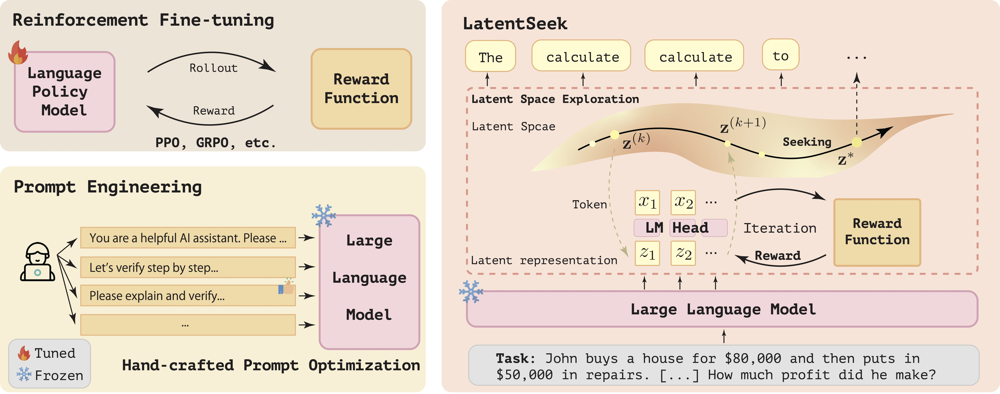

<h1 align="center"> Seek in the Dark: Reasoning via Test-Time Instance-Level Policy
Gradient in Latent Space</h1>
<div align="center">
 <a href="https://bigai-nlco.github.io/LatentSeek"></a>
 <a href="https://arxiv.org/abs/2505.13308"></a>
</div>

## Introduction

# 

LatentSeek is a novel framework that enhances LLM reasoning through **Test-Time Instance-level Adaptation (TTIA)** within the model's **latent space**. Specifically, LatentSeek leverages policy gradient to iteratively update latent representations, guided by self-generated reward signals. 

## Installation

```bash
conda create -n latentseek python=3.10
conda activate latentseek
pip3 install torch torchvision torchaudio
pip install transformers datasets tqdm accelerate
pip install termcolor

# for evaluation
cd src/extract_judge_answer/latex2sympy
pip install -e .
pip install math-verify
pip install word2number
```

## Usage

```bash
cd src
cd scripts
vim example.sh # modify this according to your need
cd ..
sh scripts/example.sh
```

The example.sh file

```bash
PATH_TO_DATA= # path to the dataset (the path str should contain either "AIME_2024", "gsm8k", "MATH-500")
PATH_TO_MODEL= # path to the model 
rho= # the value of rho, which is the hyperparameter for the fractional update
lr= # the learning rate
solver_prompt_idx= # the index of the solver prompt to use (0 for "boxex", 1 for "json")

python main.py \
    --dataset $PATH_TO_DATA \
    --model_name_or_path $PATH_TO_MODEL \
    --output_dir ./output \
    --k $rho \
    --lr $lr \
    --solver_prompt_idx $solver_prompt_idx \
    --device "cuda" \
```

## Files for Modification

* Main logic file: [main](./src/main.py)
* Opt generation file (LatentSeek core): [opt](./src/opt_generation.py)
* CoT generation file (original generation): [ori](./src/ori_generation.py)
* Data: [data](./src/data.py)
* Reward Model: [reward](./src/rewards/reward.py)
* Self-Reward Prompts: [self-reward prompts](./src/prompts/vera_prompts.py)
* CoT Prompts: [CoT prompts](./src/prompts/solver_prompts.py)

## Citation
```bibtex
@misc{li2025seekdarkreasoningtesttime,
      title={Seek in the Dark: Reasoning via Test-Time Instance-Level Policy Gradient in Latent Space}, 
      author={Hengli Li and Chenxi Li and Tong Wu and Xuekai Zhu and Yuxuan Wang and Zhaoxin Yu and Eric Hanchen Jiang and Song-Chun Zhu and Zixia Jia and Ying Nian Wu and Zilong Zheng},
      year={2025},
      eprint={2505.13308},
      archivePrefix={arXiv},
      primaryClass={cs.LG},
      url={https://arxiv.org/abs/2505.13308}, 
}
```

## Contact
* If you have any questions, please send me an email at: lihengli@stu.pku.edu.cn
